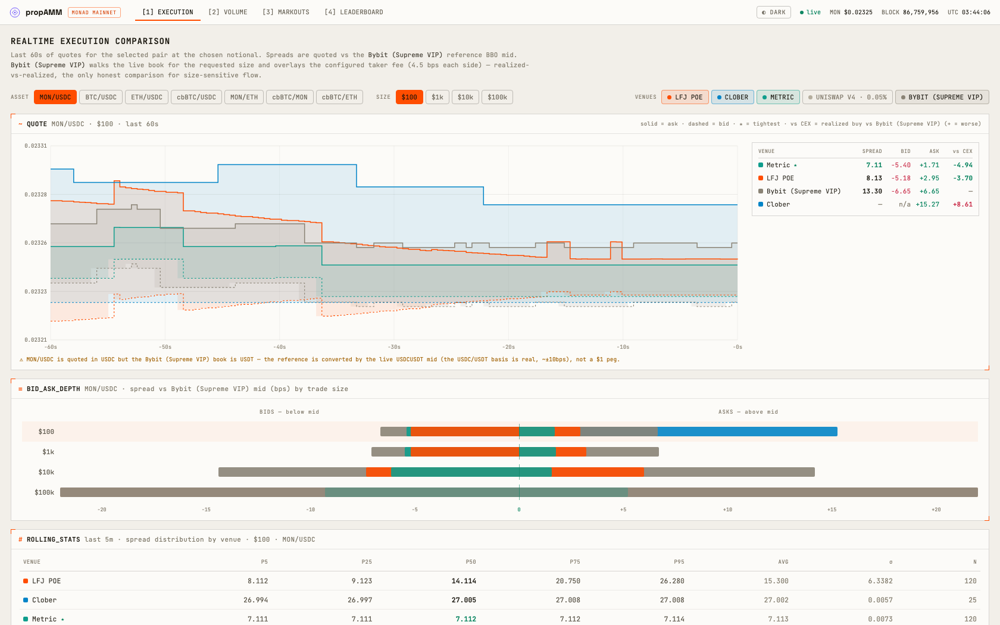

# propAMM · Monad — execution monitor

**Live at [mpamm.wtf](https://mpamm.wtf).**

A real-time dashboard for **propAMMs on Monad mainnet** — venues where a market maker (or the oracle it anchors to) sets the price: **LFJ POE**, **Metric**, **Clober**, **Hanji**, each a composable adapter. Every pair is benchmarked against its **own CEX reference** — Bybit for MON, Binance for BTC/ETH — **converted into the pair's own terms** (live stable cross + wrapped/native basis, never a $1 peg). Four views: live execution quality (with an optional Uniswap v4 baseline band), filled volume + quote-update gas burn, swap markouts, and a markout leaderboard.



```
┌──────────────┐   Multicall3 eth_call (quotes)   ┌──────────────┐   REST + WS    ┌─────────────┐
│ Monad RPC    │──  getLogs tail (fills) ────────▶│   server/    │───────────────▶│    web/     │
│ Bybit V5 WS  │──  MONUSDT book + crosses ──────▶│ DataSource   │  /api  /stream │ React tabs  │
│ Binance WS   │──  BTC/ETH books + WBTCBTC ─────▶│              │                │             │
└──────────────┘                                  └──────────────┘                └─────────────┘
```

## Quick start

```bash
npm install
npm run dev          # backend (live) on :8787 + Vite on :5173 → open http://localhost:5173
```

By default the backend runs **live** — real Monad RPC (Multicall3 quotes + `getLogs` fills) + the CEX reference feeds. It fails fast if the chain is unreachable rather than serving fabricated data. To run fully offline against the deterministic **simulator** (no external dependencies):

```bash
DATA_SOURCE=sim npm run dev
```

`npm run typecheck` typechecks all workspaces · `npm -w server run test` runs the tests · `npm run build` builds the frontend.

## Add your venue

The whole system is venue-agnostic: **one adapter file + one registry line** lists a new protocol — volume, fills, markouts, leaderboard, gas burn and the UI all follow, with lifetime on-chain history backfilled automatically. Start with **[docs/adapters.md](docs/adapters.md)**.

```bash
# develop your adapter in isolation against the real chain
VENUES=myvenue BACKFILL=off MARKOUT_BACKFILL=off GAS_METRIC=off npm run dev
```

## Docs

| | |
|---|---|
| [docs/adapters.md](docs/adapters.md) | Writing a venue adapter — interface, correctness rules, local dev, verification, PR checklist |
| [docs/architecture.md](docs/architecture.md) | How it works — propAMM scope, quote/fill paths, persist-forward indexer, pair-terms CEX references, data model, API |
| [docs/spec.md](docs/spec.md) | The venue-agnostic design spec — invariants, contracts, key decisions |
| [docs/deploy.md](docs/deploy.md) | Hosting — single container, Render blueprint, configuration knobs |

The pixel-level design source lives under [`design/`](design/).
